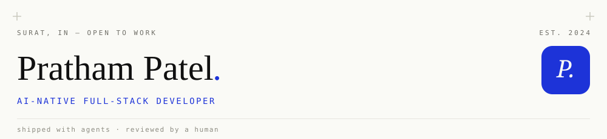
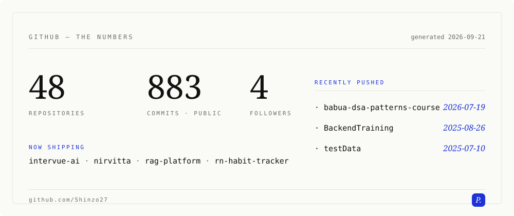

<!-- ══════════════════════════════════════════════════════ -->
<!--  Branded profile — all art is custom SVG in /assets,   -->
<!--  regenerated by .github/workflows/gen-stats.yml        -->
<!-- ══════════════════════════════════════════════════════ -->

<picture>
  <source media="(prefers-color-scheme: dark)" srcset="./assets/header-dark.svg" />
  
</picture>

### whoami

Full-stack developer at **Patoliya Infotech** - leading backend development on an active product while practising **AI-native development** daily: I frame the spec, delegate implementation to agents (Cursor, Claude Code, Codex), and review every merged diff like my name is on it. Because it is.

> Strong validation · correct failure modes · typed end to end · shipped fast without shipping mess

| | |
|:---|:---|
| 🚀 shipping | [**nirvitta**](https://nirvitta.in) - WhatsApp-first fashion commerce, live · **intervue-ai** - MCP-governed AI interviewer, two-model scoring |
| 🌱 learning | React Native + Expo, AI-natively — habit-tracker → Supabase sync → EAS-built APK |
| 🎯 open to | AI-native / full-stack roles & freelance - remote-friendly (Surat, IN) |

### selected work

| | project | what it is | stack |
|:--:|:---|:---|:---|
| 01 | [**nirvitta**](https://nirvitta.in) | conversational WhatsApp checkout instead of a cart, Payload CMS 3, migrations in build, media on Blob | next · payload · neon · gsap |
| 02 | **intervue-ai** | multi-tenant AI interview SaaS, permission-checked MCP tools, AI/HUMAN/SYSTEM audit, dual-model scoring | nest · prisma · mcp · bullmq |
| 03 | **rag-platform** | hybrid retrieval, redis semantic cache, RAGAS evals gating CI, cost-per-query dashboards | ts · pgvector · redis |

### toolkit

```
frontend    React · Next.js · Tailwind · shadcn/ui · GSAP · Framer Motion
backend     Node.js · Express · NestJS · REST · Socket.IO · RBAC
data        PostgreSQL · Prisma · Redis · MongoDB · Neon · Supabase
ai-native   Cursor · Claude Code · Codex · MCP · OpenAI API · RAG
infra       Docker · AWS · Nginx · GitHub Actions · Vercel
craft       system design · evals · CI/CD · validation at boundaries
```

<picture>
  <source media="(prefers-color-scheme: dark)" srcset="./assets/stats-dark.svg" />
  
</picture>

### the receipts

<picture>
  <source media="(prefers-color-scheme: dark)" srcset="https://raw.githubusercontent.com/Shinzo27/Shinzo27/output/github-contribution-snake-dark.svg" />
  <source media="(prefers-color-scheme: light)" srcset="https://raw.githubusercontent.com/Shinzo27/Shinzo27/output/github-contribution-snake.svg" />
  
</picture>

### connect

[linkedin](https://linkedin.com/in/prathamm27) &nbsp;·&nbsp; [prathampatel5553@gmail.com](mailto:prathampatel5553@gmail.com) &nbsp;·&nbsp; [x](https://x.com/Pratham68410619) &nbsp;·&nbsp; [resume](https://drive.google.com/file/d/1oatNMs7xdr3ySQcsOrWBdAcyI-Yn3Wvu/view?usp=sharing)

---

<sub>shipped with agents, reviewed by a human. If something here breaks, that's the human's fault.</sub>
